# 气象要素订正系统 (Weather Correction System)

> 基于机器学习的网格气象数据偏差订正平台，利用站点观测数据对 CARAS 再分析数据进行统计订正，显著提升气象要素的预报精度。

## 系统概览

<div align="center">
  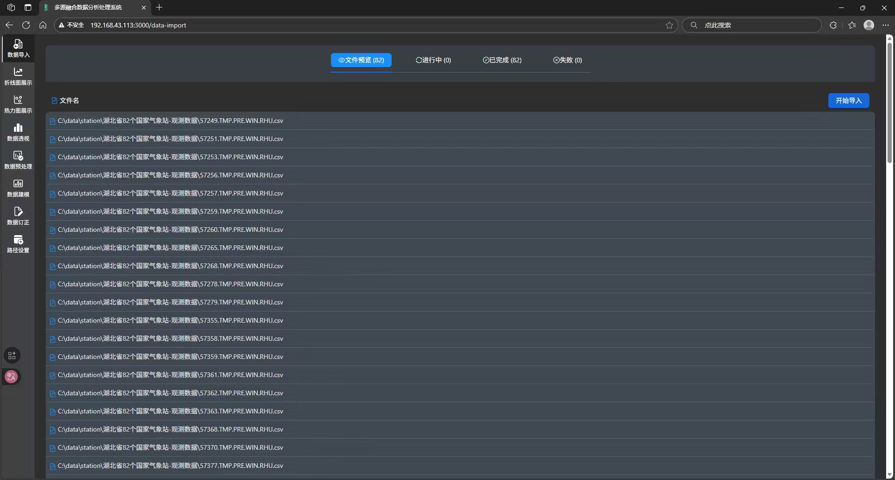
  <p>系统主界面（前端为项目完整度自行搭建）</p>
</div>

---

## 项目背景

气象数值预报模式输出的网格再分析数据往往存在系统性偏差，直接影响下游预报产品的准确性。本项目构建了一套从数据接入、清洗处理、模型训练到订正评估的**全流程自动化订正系统**，覆盖温度、相对湿度、风速、降水量四类核心气象要素。

**数据规模：** 2008—2023 年共 16 年逐小时观测数据，覆盖 **82 个气象站点**，数据量级达**千万级**。

## 核心功能

### 全流程工作流

```
数据导入 → 数据预览 → 数据处理 → 模型训练 → 多站点评估 → 数据订正 → 导出产品
```

| 模块 | 说明 |
|------|------|
| **数据导入** | 站点观测数据自动入库 + NetCDF 网格再分析数据解析，支持断点续传 |
| **数据预览** | 按站点/时间范围可视化筛选，数据质量统计（缺失值、异常值） |
| **数据处理** | 异常值清洗、时间特征/空间特征/地形特征工程、数据透视分析 |
| **模型训练** | XGBoost / LightGBM 双算法支持，自动超参数优化 + 早停防过拟合 |
| **数据订正** | 模型推理生成订正场，支持批量订正多个时间范围 |
| **多站点评估** | 82 站点逐一评估，生成 JSON + Excel 评估报告，支持季节筛选，支持逐站点指标统计 |

### 支持的气象要素

| 要素 | 说明 | 订正策略 |
|------|------|----------|
| 温度 | 2m 气温 | 残差订正（模型预测 + 格点值） |
| 相对湿度 | 2m 相对湿度 | 残差订正（模型预测 + 格点值） |
| 过去1小时降水量 | 1h 累计降水 | 残差订正（模型预测 + 格点值） |
| 2分钟平均风速 | 10m 风速 | 直接订正（仅模型预测） |

---

## 订正效果展示

### 站点分布

<div align="center">
  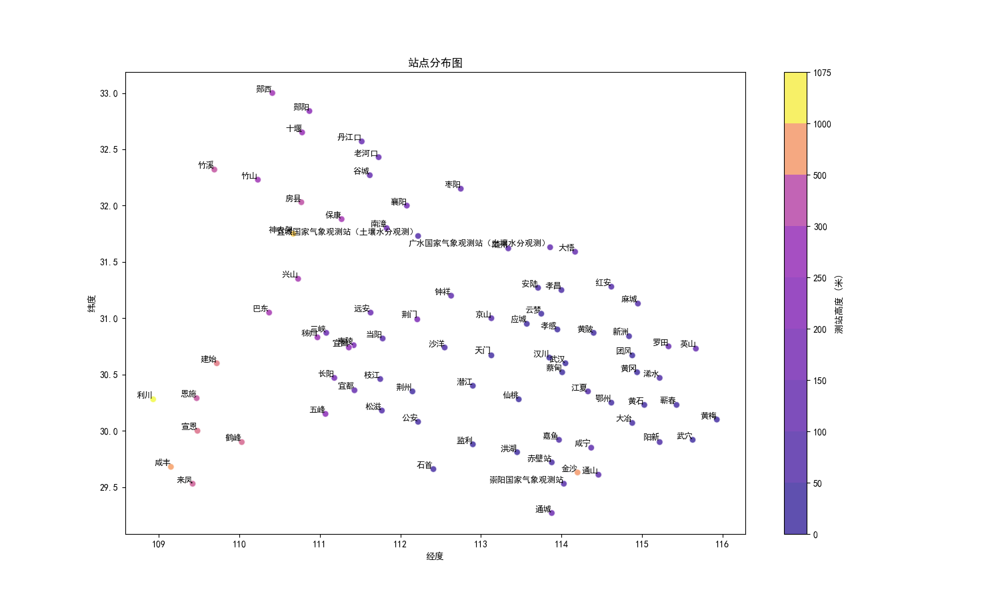
</div>

### 订正前后误差热力图对比

通过格点级误差热力图，直观展示订正前后的精度提升效果：

<table>
  <tr>
    <td align="center"><b>温度</b></td>
    <td>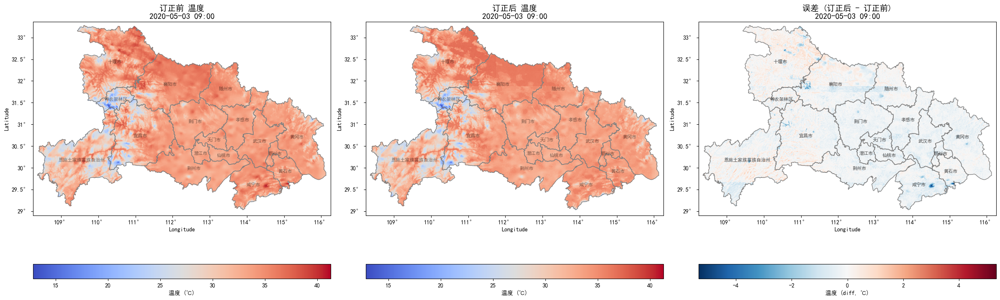</td>
  </tr>
  <tr>
    <td align="center"><b>相对湿度</b></td>
    <td>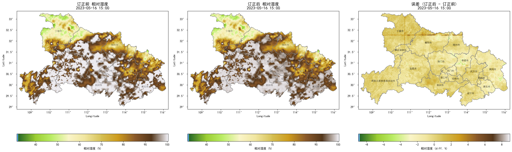</td>
  </tr>
  <tr>
    <td align="center"><b>2分钟平均风速</b></td>
    <td>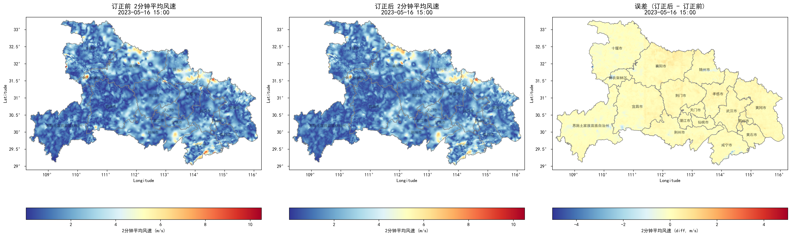</td>
  </tr>
  <tr>
    <td align="center"><b>过去1小时降水量</b></td>
    <td>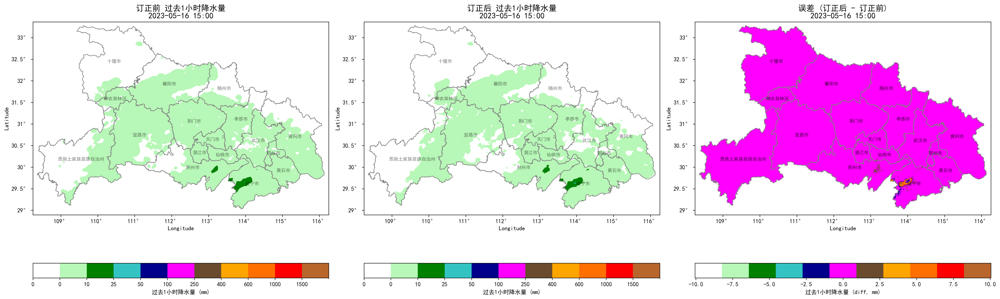</td>
  </tr>
</table>

### 82 站点指标统计

对全部 82 个观测站点逐一计算订正前后的评估指标，直观对比各站点订正效果差异：

| 2分钟平均风速 | 过去1小时降水量 |
|:---:|:---:|
| 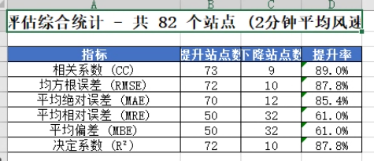 | 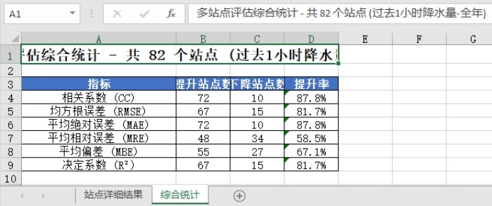 |

### 模型指标对比

| 相对湿度 | 2分钟平均风速 | 过去1小时降水量 |
|:---:|:---:|:---:|
| 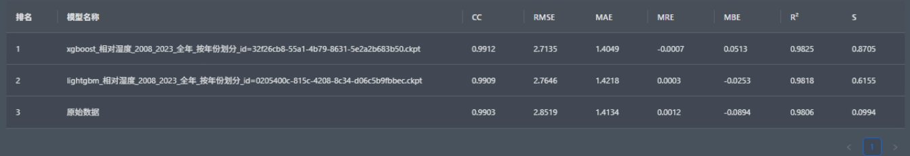 | 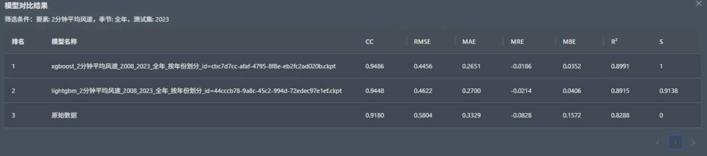 | 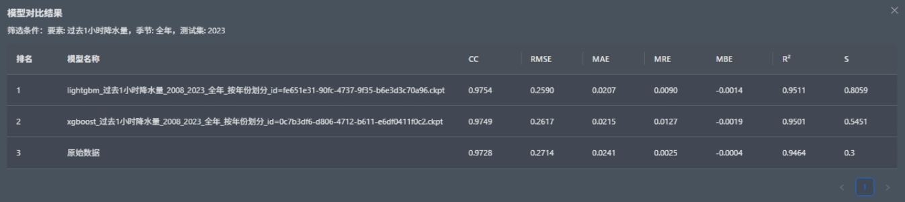 |

### 评估指标说明

| 指标 | 全称 | 说明 | 方向 |
|------|------|------|------|
| CC | 相关系数 | 预报与观测的线性相关性 | 越大越好 |
| RMSE | 均方根误差 | 预报误差的离散程度 | 越小越好 |
| MAE | 平均绝对误差 | 预报误差的平均水平 | 越小越好 |
| MRE | 平均相对误差 | 相对误差的平均值 | 绝对值越小越好 |
| MBE | 平均偏差 | 系统性偏差的度量 | 绝对值越小越好 |
| R² | 决定系数 | 模型解释方差的比例 | 越大越好 |

---

## 技术架构

```
┌─────────────────────────────────────────────────┐
│                Frontend (React)                  │
├─────────────────────────────────────────────────┤
│              Backend (FastAPI)                    │
│     RESTful API + 异步任务 + SQLAlchemy ORM       │
├────────────┬───────────┬────────────────────────┤
│  XGBoost   │ LightGBM  │   Scikit-learn         │
├────────────┴───────────┴────────────────────────┤
│              数据层 (SQLite + NetCDF)              │
│         pandas · xarray · GeoPandas               │
└─────────────────────────────────────────────────┘
```

### 技术栈（后端）

| 类别 | 技术 |
|------|------|
| **Web 框架** | FastAPI + Uvicorn（异步高性能） |
| **ORM** | SQLAlchemy + SQLite |
| **机器学习** | XGBoost / LightGBM / Scikit-learn |
| **数据处理** | Pandas / NumPy / xarray / NetCDF4 / GeoPandas |
| **可视化** | Matplotlib |
| **模型持久化** | Joblib |

---

## 后端项目结构

```
backend/
├── app/
│   ├── api/routers/             # API 路由层（9 个业务模块）
│   │   ├── config_manage.py        # 配置管理
│   │   ├── data_import.py          # 数据导入
│   │   ├── data_preview.py         # 数据预览
│   │   ├── data_process.py         # 数据处理
│   │   ├── data_pivot.py           # 数据透视
│   │   ├── model_train.py          # 模型训练
│   │   ├── data_correct.py         # 数据订正
│   │   ├── multi_station_eval.py   # 多站点评估
│   │   └── task_operate.py         # 任务管理
│   ├── core/                   # 核心业务逻辑
│   │   ├── config.py               # 全局配置
│   │   ├── schemas.py              # 数据模型定义
│   │   ├── data_process.py         # 数据处理引擎
│   │   ├── model_train.py          # 模型训练引擎
│   │   ├── data_correct.py         # 数据订正引擎
│   │   ├── data_pivot.py           # 数据透视引擎
│   │   ├── data_preview.py         # 数据预览引擎
│   │   └── data_mapping.py         # 数据字段映射
│   ├── tasks/                  # 异步任务执行层
│   │   ├── data_import.py          # 导入任务
│   │   ├── data_process.py         # 处理任务
│   │   ├── model_train.py          # 训练任务
│   │   ├── data_correct.py         # 订正任务
│   │   ├── multi_station_eval.py   # 评估任务
│   │   └── ...
│   ├── db/                     # 数据库层
│   │   ├── database.py             # 数据库连接
│   │   ├── db_models.py            # ORM 模型
│   │   └── crud.py                 # 增删改查
│   └── utils/                  # 工具函数
│       ├── metrics.py              # 评估指标计算
│       └── file_io.py              # 文件读写
├── config/                     # 配置文件目录
└── output/                     # 输出结果目录
```

---

## 快速开始

```bash
# 安装依赖
pip install -r requirements.txt

# 启动后端服务
cd backend
uvicorn app.main:app --reload --port 8000

# API 文档自动生成
# 访问 http://localhost:8000/docs 查看 Swagger UI
```

---

## 项目亮点

### 架构设计

1. **模块化分层架构**：路由层（Router）→ 业务逻辑层（Core）→ 异步任务层（Task）→ 数据访问层（DB/CRUD）四层解耦，职责清晰，便于独立测试与扩展
2. **异步任务 + 子任务分解**：耗时任务（导入/训练/订正/评估）均通过 BackgroundTasks 异步执行，每个任务可拆分为多个子任务，支持独立进度追踪、状态查询与中途取消

### 性能优化

3. **多进程并行订正**：基于 `ProcessPoolExecutor` 进程池，自动检测 CPU 核心数，多个 NetCDF 文件并行推理，订正速度线性提升
4. **分块流式处理**：数据导入使用 `pd.read_csv(chunksize=50000)` 分块读取，数据处理使用 `pd.read_sql(chunksize=8760)` 按年分块查询，避免千万级数据一次性加载导致内存溢出
5. **Upsert 批量写入**：利用 SQLite 原生 `INSERT ON CONFLICT DO UPDATE` 语句批量写入，避免逐行插入的性能瓶颈
6. **断点续传机制**：数据导入时自动查询历史已完成文件并跳过，避免重复处理，支持中断后恢复执行
7. **主动内存管理**：订正模块在每处理完一个空间块后通过 `del` + `gc.collect()` 显式释放中间变量，控制峰值内存占用

### ML Pipeline

8. **完整机器学习流水线**：数据清洗 → 特征工程（时间特征、滞后特征、DEM 地形特征）→ 模型训练 → 批量推理 → 多维评估，全流程自动化
9. **双订正策略自适应**：根据气象要素特性自动选择残差订正（温度/湿度/降水）或直接订正（风速），无需人工干预
10. **XGBoost / LightGBM 双算法支持**：可配置超参数 + 早停策略防过拟合，支持按年份或按站点划分训练/测试集

### 评估体系

11. **多维评估**：6 项指标（CC / RMSE / MAE / MRE / MBE / R²）× 82 站点逐一统计 × 季节筛选，输出 JSON + Excel 双格式报告
12. **空间可视化**：格点级订正前后误差热力图，直观展示订正效果的空间分布差异
13. **逐站点指标柱状图**：82 个站点订正前后指标对比，快速定位订正效果不佳的站点
